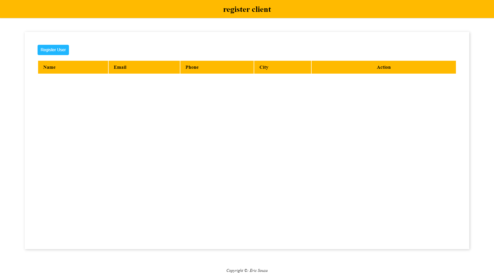
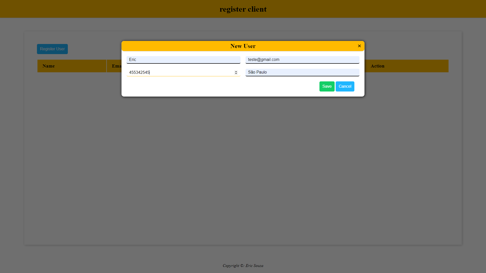
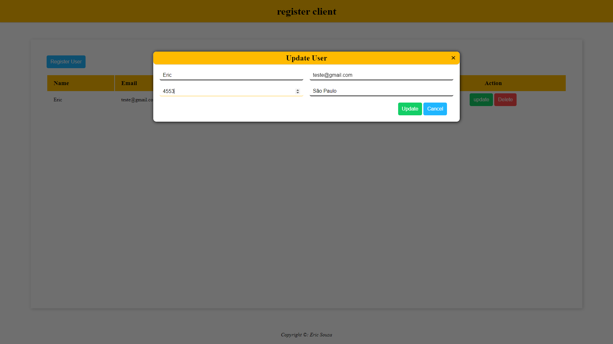
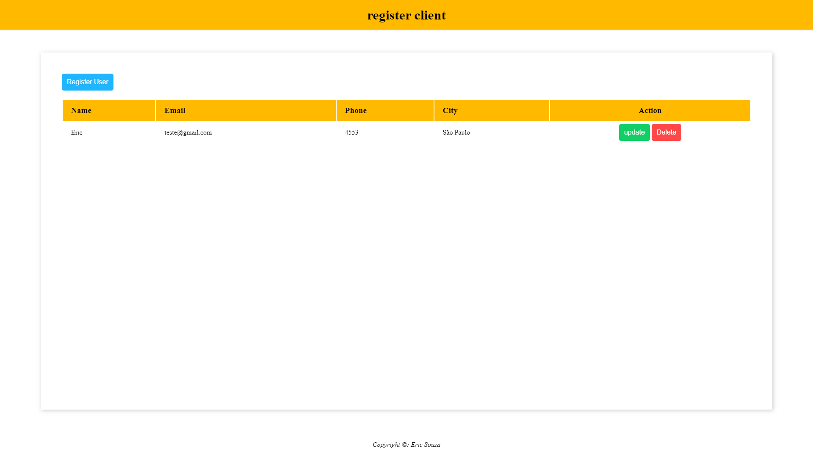

<div align="center">

# 📝 CRUD Users 📝


Bem-vindo à página CRUD Users! Aqui você pode registrar novos usuários, atualizar informações existentes e excluir usuários do sistema.

<h1 align="center"> 🚀 Deploy 🌌</h1>


Para visualizar a página em ação, você pode conferir o deploy do projeto clicando [aqui](https://ericsouzadossantos.github.io/Listagem-de-usuarios/). ou você também pode acessar o projeto diretamente pelo seguinte URL:

[https://ericsouzadossantos.github.io/Listagem-de-usuarios/](https://ericsouzadossantos.github.io/Listagem-de-usuarios/)

## 💻 Preview da Página

### 🏠 Página Inicial

-  A página inicial exibe a tabela de registros de usuários, mostrando os nomes, e-mails, telefones e cidades dos usuários registrados. A partir daqui, você pode acessar as funcionalidades de registro, atualização e exclusão de usuários.


### 🆕 New User

- **Funcionalidade**: Ao clicar no botão "Register User", um modal é aberto onde você pode inserir os dados do novo usuário, como nome, e-mail, telefone e cidade. Após preencher os campos e clicar em "Save", os dados do usuário são registrados no sistema.


### 🔄 Update User

- **Funcionalidade**: Cada registro na tabela tem botões "update" e "Delete" que permitem atualizar ou excluir um usuário existente. Ao clicar em "update", o modal de edição é aberto, permitindo que você atualize os dados do usuário selecionado. Após confirmar as alterações, os dados são atualizados no sistema.


### ❌ Delete User

- **Funcionalidade**: Ao clicar no botão "Delete", o usuário correspondente será removido do sistema. Isso exclui permanentemente o registro do usuário da tabela e dos dados armazenados localmente.

## 🚀 Funcionalidades 🚀

- **Registrar Novo Usuário**: Clique no botão "Register User" para abrir um modal onde você pode inserir os dados do novo usuário e salvá-los.
- **Atualizar Usuário**: Cada registro na tabela tem botões "update" e "Delete" que permitem atualizar ou excluir um usuário existente.
- **Excluir Usuário**: Ao clicar no botão "Delete", o usuário correspondente será removido do sistema.

</div>


<h1 align="center"> 📂 Clonando o Repositório 🖥️ </h1>

Se você deseja contribuir ou apenas visualizar o código-fonte, siga estas etapas para clonar o repositório para o seu computador local:

1. Abra o terminal.
2. Navegue até o diretório onde deseja clonar o repositório.
3. Execute o seguinte comando no terminal:

```bash
git clone https://github.com/EricSouzaDosSantos/Listagem-de-usuarios.git
```
Além disso, se preferir, você pode dar um fork do projeto para trabalhar em seu próprio repositório do GitHub.

## 👩‍💻 Desenvolvedor 👨‍💻

Este projeto foi desenvolvido por [Eric Souza](https://github.com/EricSouzaDosSantos).

---

<div align="center">

Copyright &copy; Eric Souza

</div>
